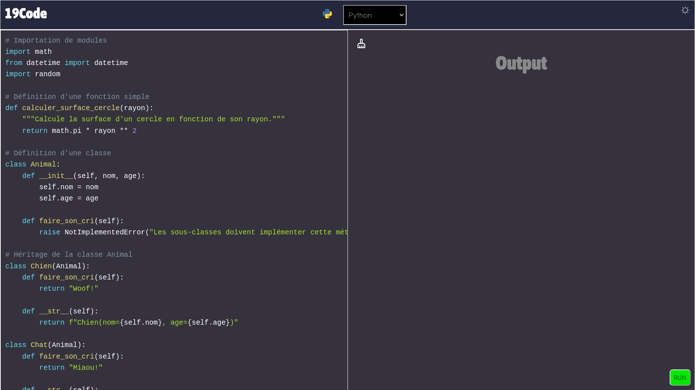

# Code Executor App

L'application **Code Executor** est une plateforme interactive qui permet aux utilisateurs d'exécuter du code dans plusieurs langages de programmation, notamment JavaScript, Python, C et C++. Elle est construite avec React et utilise  [API CODE executor](https://github.com/repsorp39/API-Code-Executor) pour gérer l'exécution du code en toute sécurité.

## Fonctionnalités

### 1. Exécution de Code en Temps Réel
- **Multi-langages** : Exécutez du code en JavaScript, Python, C et C++ directement dans votre navigateur.
- **Résultats Instantanés** : Obtenez les résultats de l'exécution du code en temps réel, y compris les sorties standard et les erreurs.

### 2. Sauvegarde Automatique
- **Sauvegarde en Temps Réel** : Le code saisi par l'utilisateur est automatiquement sauvegardé localement dans le navigateur. Cela permet de reprendre le travail là où vous l'avez laissé, même après avoir fermé l'onglet ou actualisé la page.
- **Récupération Facile** : Le code sauvegardé est automatiquement chargé au démarrage de l'application.

### 3. Interface Utilisateur Intuitive
- **Éditeur de Code** : Un éditeur de code convivial avec coloration syntaxique pour une meilleure lisibilité.
- **Boutons d'Exécution et de Réinitialisation** : Exécutez votre code avec un seul clic ou réinitialisez l'éditeur pour commencer à zéro.
